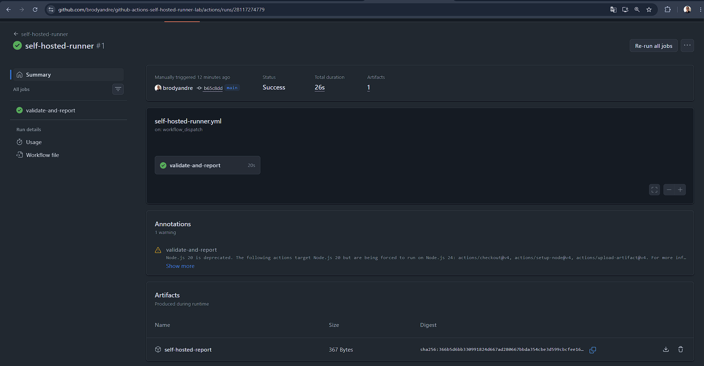
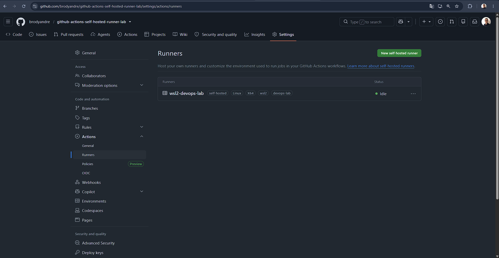
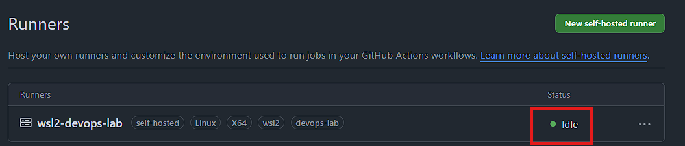
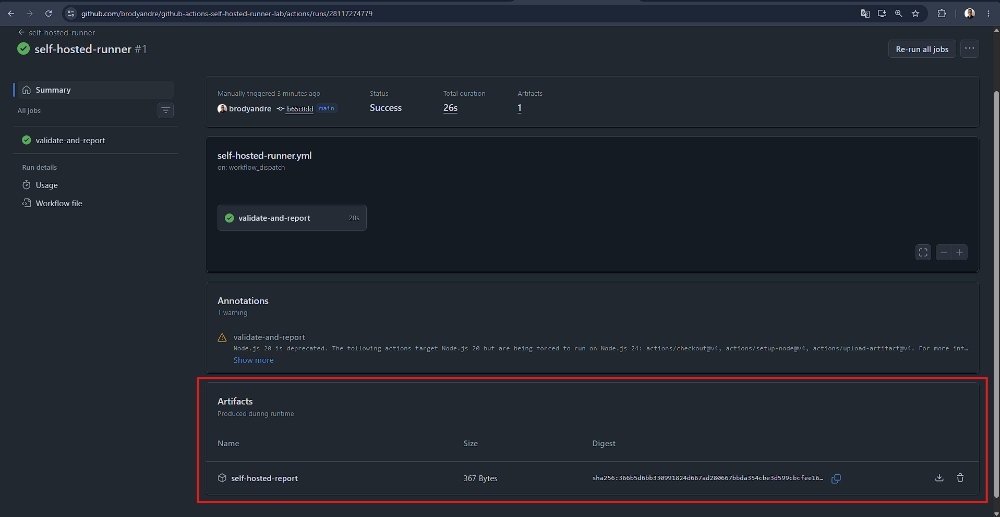
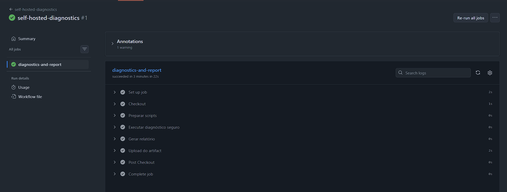
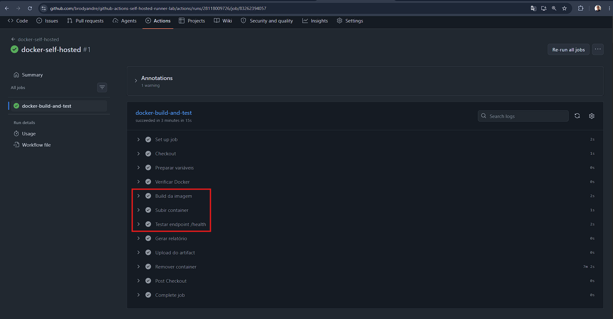
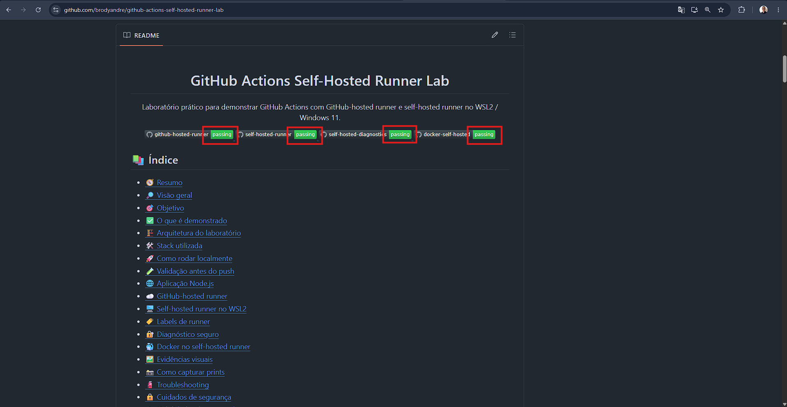

<div align="center">
  <h1>GitHub Actions Self-Hosted Runner Lab</h1>
  <p>Laboratório prático para demonstrar GitHub Actions com GitHub-hosted runner e self-hosted runner no WSL2 / Windows 11.</p>
  <p>
    <a href="https://github.com/brodyandre/github-actions-self-hosted-runner-lab/actions/workflows/github-hosted-runner.yml">
      
    </a>
    <a href="https://github.com/brodyandre/github-actions-self-hosted-runner-lab/actions/workflows/self-hosted-runner.yml">
      
    </a>
    <a href="https://github.com/brodyandre/github-actions-self-hosted-runner-lab/actions/workflows/self-hosted-diagnostics.yml">
      
    </a>
    <a href="https://github.com/brodyandre/github-actions-self-hosted-runner-lab/actions/workflows/docker-self-hosted.yml">
      
    </a>
  </p>
</div>

<a id="indice"></a>
## 📚 Índice

- [🧭 Resumo](#resumo)
- [🔎 Visão geral](#visao-geral)
- [🎯 Objetivo](#objetivo)
- [✅ O que é demonstrado](#o-que-e-demonstrado)
- [🏗️ Arquitetura do laboratório](#arquitetura-do-laboratorio)
- [🛠️ Stack utilizada](#stack-utilizada)
- [🚀 Como rodar localmente](#como-rodar-localmente)
- [🌐 Aplicação Node.js](#aplicacao-nodejs)
- [☁️ GitHub-hosted runner](#github-hosted-runner)
- [🖥️ Self-hosted runner no WSL2](#self-hosted-runner-no-wsl2)
- [🏷️ Labels de runner](#labels-de-runner)
- [🔐 Diagnóstico seguro](#diagnostico-seguro)
- [🐳 Docker no self-hosted runner](#docker-no-self-hosted-runner)
- [🖼️ Evidências visuais](#evidencias-visuais)
- [📸 Como capturar prints](#como-capturar-prints)
- [🧯 Troubleshooting](#troubleshooting)
- [🔒 Cuidados de segurança](#cuidados-de-seguranca)
- [💼 Habilidades demonstradas](#habilidades-demonstradas)
- [🗺️ Próximos passos](#proximos-passos)
- [👤 Autor](#autor)

[⬆️ Retornar ao índice](#indice)

<a id="resumo"></a>
## 🧭 Resumo

Laboratório simples e objetivo para demonstrar GitHub Actions com foco em `self-hosted runner`, segurança operacional e uso prático de `Node.js`, `Docker` e `WSL2`.

[⬆️ Retornar ao índice](#indice)

<a id="visao-geral"></a>
## 🔎 Visão geral

Este projeto foi pensado como peça de portfólio técnico para demonstrar uma esteira pequena, clara e profissional usando GitHub Actions em dois cenários:

- `GitHub-hosted runner` para validação padrão.
- `Self-hosted runner` no `WSL2 / Windows 11` para uso controlado de recursos locais.

O laboratório reforça competências relevantes para vagas em:

| Área | Valor demonstrado |
| --- | --- |
| DevOps | Automação de workflows, uso de runners e organização operacional |
| CI/CD | Execução manual e validada de pipelines simples |
| Cloud | Entendimento de ambientes efêmeros versus infraestrutura controlada |
| Engenharia de Dados | Boas práticas de automação, rastreabilidade e segurança |

[⬆️ Retornar ao índice](#indice)

<a id="objetivo"></a>
## 🎯 Objetivo

Demonstrar, de forma prática, como:

- validar uma aplicação Node.js com GitHub Actions;
- comparar `GitHub-hosted` e `self-hosted runner`;
- executar diagnóstico seguro sem expor segredos;
- usar Docker no runner local para build e teste simples;
- adotar um uso mais seguro de `self-hosted runners`.

[⬆️ Retornar ao índice](#indice)

<a id="o-que-e-demonstrado"></a>
## ✅ O que é demonstrado

- Workflow padrão em `ubuntu-latest`.
- Workflow manual apontando para runner local com labels.
- Diagnóstico seguro do ambiente do runner.
- Build local de imagem Docker no `self-hosted runner`.
- Geração de artifacts para evidência técnica.
- Documentação em PT-BR com foco profissional.

[⬆️ Retornar ao índice](#indice)

<a id="arquitetura-do-laboratorio"></a>
## 🏗️ Arquitetura do laboratório

```text
GitHub Repository
├── Workflow 1: github-hosted-runner
│   └── Runner: ubuntu-latest
├── Workflow 2: self-hosted-runner
│   └── Runner: WSL2 / Windows 11 com labels compatíveis
├── Workflow 3: self-hosted-diagnostics
│   └── Runner: WSL2 / Windows 11 com diagnóstico seguro
└── Workflow 4: docker-self-hosted
    └── Runner: WSL2 / Windows 11 com Docker disponível

Aplicação de exemplo
└── Node.js HTTP Server
    ├── GET /
    ├── GET /health
    ├── GET /runner-info
    └── GET /build-info
```

[⬆️ Retornar ao índice](#indice)

<a id="stack-utilizada"></a>
## 🛠️ Stack utilizada

| Item | Uso no laboratório |
| --- | --- |
| `Node.js 20` | Aplicação e execução local |
| `node:http` | API HTTP nativa, sem framework pesado |
| `node:test` | Testes automatizados |
| `GitHub Actions` | Automação dos workflows |
| `Bash` | Scripts de validação e diagnóstico |
| `Docker` | Build e teste local da imagem |
| `WSL2` | Ambiente do self-hosted runner |

[⬆️ Retornar ao índice](#indice)

<a id="como-rodar-localmente"></a>
## 🚀 Como rodar localmente

Pré-requisito recomendado: `Node.js 20` ou superior.

1. Copie `.env.example` para `.env`.
2. Se usar `nvm`, execute `nvm use`.
3. Rode `make install`.
4. Rode `make check`.
5. Inicie a aplicação com `npm start` ou `make start`.
6. Valide os endpoints locais.

Comandos úteis:

```bash
cp .env.example .env
nvm use
make install
make check
npm start
curl http://localhost:3000/
curl http://localhost:3000/health
curl http://localhost:3000/runner-info
curl http://localhost:3000/build-info
```

Observação:
Se o Node local estiver abaixo da versão esperada, alguns comandos do projeto usam Docker com `Node 20` como fallback.

[⬆️ Retornar ao índice](#indice)

<a id="validacao-antes-do-push"></a>
## 🧪 Validação antes do push

Antes de enviar mudanças para o GitHub, rode:

```bash
make check
```

Esse comando valida:

- presença dos arquivos principais do projeto;
- presença dos workflows centrais do laboratório;
- presença da documentação obrigatória;
- execução de `npm test` com sucesso.

Se quiser validar também a imagem Docker local:

```bash
make docker-build
```

Essa checagem é local, não exige `self-hosted runner` online e não executa workflows remotos.

[⬆️ Retornar ao índice](#indice)

<a id="aplicacao-nodejs"></a>
## 🌐 Aplicação Node.js

A aplicação foi mantida pequena para destacar o foco principal do laboratório: os runners.

Endpoints disponíveis:

| Endpoint | Finalidade |
| --- | --- |
| `GET /` | Retorna nome da aplicação e status |
| `GET /health` | Retorna status de saúde |
| `GET /runner-info` | Retorna informações seguras do ambiente |
| `GET /build-info` | Retorna nome, versão e ambiente |

Pontos positivos para portfólio:

- uso de `node:http` nativo;
- sem dependências desnecessárias;
- testes com `node:test`;
- respostas pequenas e seguras.

[⬆️ Retornar ao índice](#indice)

<a id="github-hosted-runner"></a>
## ☁️ GitHub-hosted runner

O workflow [`github-hosted-runner.yml`](.github/workflows/github-hosted-runner.yml) mostra a execução padrão do GitHub Actions em `ubuntu-latest`.

Ele demonstra:

- instalação do projeto;
- execução de testes;
- execução de diagnóstico;
- geração de artifact de validação.

Leitura rápida:

| Tipo | Característica |
| --- | --- |
| Ambiente | Efêmero e mantido pelo GitHub |
| Uso ideal | Validação padrão e setup rápido |
| Ganho profissional | Base de CI simples, previsível e reprodutível |

Registro da execução:



[⬆️ Retornar ao índice](#indice)

<a id="self-hosted-runner-no-wsl2"></a>
## 🖥️ Self-hosted runner no WSL2

O workflow [`self-hosted-runner.yml`](.github/workflows/self-hosted-runner.yml) demonstra como direcionar um job para a máquina local usando labels compatíveis no `WSL2 / Windows 11`.

Esse workflow:

- roda somente por `workflow_dispatch`;
- usa `runs-on: [self-hosted, linux, x64, wsl2]`;
- executa `npm install` e `npm test`;
- roda diagnóstico seguro;
- gera `artifact` para evidência técnica.

Como executar manualmente no GitHub:

1. Confirme que o runner está `Online`.
2. Abra a aba `Actions`.
3. Selecione `self-hosted-runner`.
4. Clique em `Run workflow`.
5. Acompanhe a execução e baixe o artifact ao final.

Valor para empregabilidade:

- mostra domínio prático de runners customizados;
- reforça entendimento de CI/CD fora de ambiente efêmero;
- evidencia cuidado com segurança e operação manual controlada.

Registros da configuração e execução:







[⬆️ Retornar ao índice](#indice)

<a id="labels-de-runner"></a>
## 🏷️ Labels de runner

As labels recomendadas para este laboratório são:

| Label | Motivo |
| --- | --- |
| `self-hosted` | Identifica runner fora do GitHub-hosted |
| `linux` | Indica o sistema operacional usado no WSL2 |
| `x64` | Indica a arquitetura |
| `wsl2` | Diferencia este runner de outros hosts Linux |
| `devops-lab` | Facilita organização do laboratório |

Exemplo de uso:

```yaml
runs-on: [self-hosted, linux, x64, wsl2]
```

[⬆️ Retornar ao índice](#indice)

<a id="diagnostico-seguro"></a>
## 🔐 Diagnóstico seguro

O script [`scripts/safe-diagnostics.sh`](scripts/safe-diagnostics.sh) foi criado para demonstrar leitura segura do ambiente do runner.

Ele imprime apenas:

- `hostname`
- `whoami`
- `pwd`
- `uname -a`
- `node --version`
- `npm --version`
- `docker --version`, se existir
- `git --version`
- data e hora
- `GITHUB_ACTIONS`
- `RUNNER_OS`
- `RUNNER_ARCH`
- `RUNNER_NAME`

Ele não imprime:

- `env` completo;
- `secrets`;
- tokens;
- arquivos sensíveis;
- caminhos de credenciais do usuário.

O workflow [`self-hosted-diagnostics.yml`](.github/workflows/self-hosted-diagnostics.yml) é manual e foi pensado para uso controlado.

Registro do diagnóstico:



[⬆️ Retornar ao índice](#indice)

<a id="docker-no-self-hosted-runner"></a>
## 🐳 Docker no self-hosted runner

O workflow [`docker-self-hosted.yml`](.github/workflows/docker-self-hosted.yml) mostra por que o `self-hosted runner` é útil quando o job precisa acessar recursos da própria máquina.

O fluxo faz:

- build local da imagem `self-hosted-runner-node-lab:local`;
- subida de container na porta `3000`;
- teste de `GET /health` com `curl`;
- limpeza do container ao final;
- geração de artifact do build.

Valor prático:

| Cenário | Ganho |
| --- | --- |
| Docker local | Uso direto do Docker Engine do host |
| CI de laboratório | Teste simples sem depender de registry |
| Portfólio DevOps | Demonstra integração entre runner, container e aplicação |

Registro do build e teste com Docker:



[⬆️ Retornar ao índice](#indice)

<a id="evidencias-visuais"></a>
## 🖼️ Evidências visuais

As imagens abaixo já podem ser usadas como evidências do laboratório no portfólio e na documentação do projeto.

| Print sugerido | Nome do arquivo | Onde inserir | O que comprova |
| --- | --- | --- | --- |
| Tela de runners no GitHub | `docs/images/runner-settings.png` | Seção `Self-hosted runner no WSL2` | Configuração da área de runners |
| Runner online no GitHub | `docs/images/self-hosted-runner-online.png` | Seção `Self-hosted runner no WSL2` | Runner local reconhecido como `Online` |
| Workflow GitHub-hosted com sucesso | `docs/images/github-hosted-workflow-success.png` | Seção `GitHub-hosted runner` | Execução padrão em `ubuntu-latest` |
| Workflow self-hosted com sucesso | `docs/images/self-hosted-workflow-success.png` | Seção `Self-hosted runner no WSL2` | Job direcionado ao runner local |
| Workflow de diagnóstico | `docs/images/diagnostics-workflow.png` | Seção `Diagnóstico seguro` | Coleta segura de informações do runner |
| Build Docker no self-hosted | `docs/images/docker-build-self-hosted.png` | Seção `Docker no self-hosted runner` | Uso do Docker do host pelo workflow |
| Badges do README | `docs/images/readme-badges.png` | Topo do README ou seção de evidências | Estado visual dos workflows |

Registro das badges do README:



[⬆️ Retornar ao índice](#indice)

<a id="como-capturar-prints"></a>
## 📸 Como capturar prints

Para deixar o README mais completo, você pode capturar:

1. A tela `Settings > Actions > Runners` com o runner `Online`.
2. A execução do workflow `github-hosted-runner`.
3. A execução do workflow `self-hosted-runner`.
4. O artifact gerado pelo workflow `self-hosted-diagnostics`.
5. O build Docker e o teste de `/health` no workflow `docker-self-hosted`.
6. As badges do topo do README após as execuções.

Orientação prática:

- salve as imagens em `docs/images/`;
- use exatamente os nomes sugeridos na tabela de evidências;
- insira cada imagem na seção correspondente quando os arquivos existirem;
- revise prints para garantir que não exibam tokens, secrets ou dados sensíveis.

[⬆️ Retornar ao índice](#indice)

<a id="troubleshooting"></a>
## 🧯 Troubleshooting

Os problemas operacionais mais comuns estão documentados em [docs/troubleshooting.md](docs/troubleshooting.md).

Resumo rápido:

- runner offline;
- labels incompatíveis;
- Docker não encontrado;
- Docker Desktop desligado;
- permissão no socket Docker;
- porta `3000` ocupada.

[⬆️ Retornar ao índice](#indice)

<a id="cuidados-de-seguranca"></a>
## 🔒 Cuidados de segurança

Este laboratório reforça o uso responsável de `self-hosted runners`.

- Não versione tokens, credenciais ou arquivos internos do runner.
- O token de registro é temporário e deve ser copiado apenas da interface do GitHub.
- Prefira `workflow_dispatch` em jobs `self-hosted`.
- Evite manter o runner ligado sem necessidade.
- Em repositórios públicos, revise com atenção qualquer job com shell, Docker ou acesso ao host.
- Mantenha o diretório do runner fora da pasta versionada do projeto.

Mais detalhes:

- [docs/security-notes.md](docs/security-notes.md)
- [docs/setup-self-hosted-runner.md](docs/setup-self-hosted-runner.md)

[⬆️ Retornar ao índice](#indice)

<a id="habilidades-demonstradas"></a>
## 💼 Habilidades demonstradas

- GitHub Actions com `GitHub-hosted` e `self-hosted runner`.
- Organização de pipelines simples para CI/CD.
- Execução segura de diagnóstico operacional.
- Uso prático de Docker em ambiente local controlado.
- Estruturação de laboratório técnico com documentação clara.
- Boa base para portfólio em DevOps, Cloud e Engenharia de Dados.

[⬆️ Retornar ao índice](#indice)

<a id="proximos-passos"></a>
## 🗺️ Próximos passos

- Versionar os prints capturados no repositório.
- Publicar mais artifacts de evidência.
- Evoluir o workflow com cache e matrix.
- Testar execução com labels mais específicas.
- Explorar uso de serviço persistente para o runner no WSL2.

[⬆️ Retornar ao índice](#indice)

<a id="autor"></a>
## 👤 Autor

**Luiz André de Souza**

- GitHub: https://github.com/brodyandre
- LinkedIn: https://www.linkedin.com/in/luiz-andre-souza-data-engineer/

[⬆️ Retornar ao índice](#indice)
